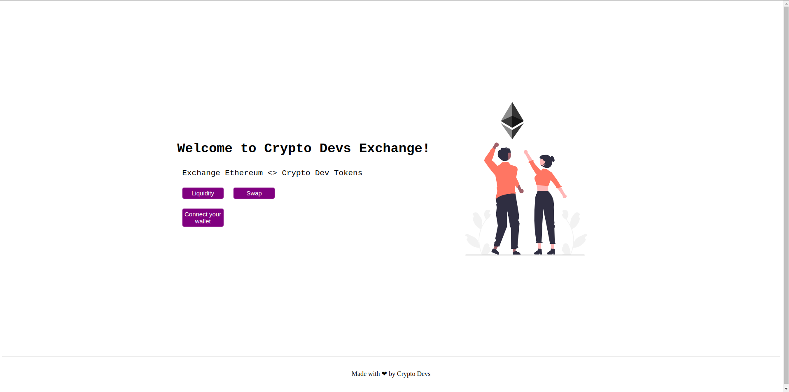

# Crypto Devs exchange (CDE) - A decentralized exchange for crypto devs

## frontend

- Tech stack used: `Next.js`
- Some of the screenshots:

## smart-contracts

- Deployed on  `polygon mumbai testnet`
- address: 0x353dAFBD87690f4D99FDCbb4158dCf88Eb054091